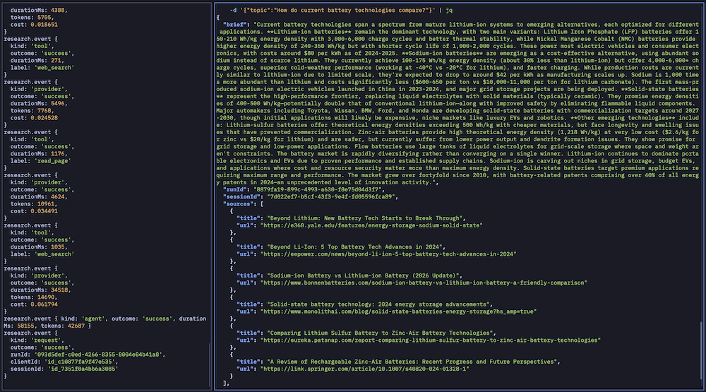

# AI Research Agent Service

This project reproduces the research-agent application described in
[“7 Steps to Building and Deploying Your First Autonomous Agent”](https://www.kdnuggets.com/7-steps-to-building-and-deploying-your-first-autonomous-agent),
using TypeScript and CG AgentFlow in place of Python and LangGraph. The goal
is to preserve the tutorial’s observable flow—research a topic with web tools,
retain conversation context, apply safety boundaries, and expose the agent
through HTTP—while evaluating what CG AgentFlow contributes to the design.

## Application overview

This project is a read-only autonomous web research service. A caller submits
a topic over HTTP, and the agent searches the public web with Tavily, reads
selected pages, and returns a concise source-grounded brief of at most 500
words.

The service has two approved agent tools: `web_search` and `read_page`.
Searches are bounded and normalized. Page reads are limited to public HTTP(S)
destinations, defend against SSRF across redirects, and return bounded text
with retrieved content clearly marked as untrusted evidence. A source is
accepted only if its URL was actually returned by a tool during that run.

The HTTP boundary adds bearer-key authentication, request-size limits,
per-client rate limits, concurrency limits, deadlines, cancellation,
session-scoped in-memory conversation history, sanitized telemetry, and
graceful shutdown. `GET /health` is a provider-free liveness check; `GET
/ready` checks authenticated service readiness; `POST /research` runs a
research request.



## What CG AgentFlow contributes to the tutorial reproduction

CG AgentFlow supplies the agent runtime and declarative integration layer that
LangGraph supplies in the original tutorial.
The application keeps research-specific concerns—Tavily and page retrieval,
SSRF policy, source grounding, public controls, and privacy-safe service
telemetry—in its own code. AgentFlow handles the general agent concerns around
those boundaries.

### Package-by-package use

All CG AgentFlow packages are pinned to `0.17.1` and are installed from the
authorized GitHub Packages registry.

| Package                       | How this project uses it                                                                              | Contribution                                                                                                                                                                 |
| ----------------------------- | ----------------------------------------------------------------------------------------------------- | ---------------------------------------------------------------------------------------------------------------------------------------------------------------------------- |
| `cg-agent-flow-agents`        | `createAgentFromFile` creates the ReAct agent from YAML.                                              | Keeps agent assembly on the framework-supported factory path and makes the YAML spec the source of truth for provider, model, limits, tools, memory, and budget.             |
| `cg-agent-flow-core`          | `BaseAgent`, `loadSpec`, lifecycle hooks, `AgentResult`, and `CostGuard`.                             | Provides the agent contract, spec loading, lifecycle integration, normalized run results, and per-request cost enforcement.                                                  |
| `cg-agent-flow-tools`         | The two retrieval adapters are framework `Tool` instances.                                            | Gives `web_search` and `read_page` a common tool shape while the application injects transports and enforces the hard read-only allow-list.                                  |
| `cg-agent-flow-memory`        | Conversation memory hooks, `LocalMemoryStore`, and memory-entry validation.                           | Connects the YAML sliding-window policy to session-scoped follow-up requests. The store is intentionally process-local and is not durable.                                   |
| `cg-agent-flow-llm`           | Provider response/message types at the integration boundary.                                          | Provides the framework’s LLM-facing contracts without making provider calls part of the deterministic default tests.                                                         |
| `cg-agent-flow-guardrails`    | Used by the optional showcase for prompt-injection blocking, secret redaction, and output validation. | Demonstrates reusable framework guardrails and direction-safe resolution; production keeps its existing application-level validation and security controls authoritative.    |
| `cg-agent-flow-observability` | Used by the optional showcase for lifecycle tracing hooks and an in-memory tracer.                    | Demonstrates framework tracing with an exporter that retains only bounded, allow-listed metadata. Production telemetry remains in the application’s sanitized metrics path.  |
| `cg-agent-flow-evaluation`    | Used by the optional showcase evaluation harness.                                                     | Adds framework reasoning, tool-selection, and answer evaluators, plus project-specific grounding, length, uncertainty, and prompt-injection checks and regression detection. |

### Benefits in this application

AgentFlow improved the application in several concrete ways:

- YAML makes the agent’s model, temperature, token and iteration limits,
  observation bound, memory strategy, tool allow-list, and `CostGuard` policy
  visible and reviewable without duplicating them in application code.
- The factory and lifecycle hooks provide a narrow integration point for
  injected tools, cancellation, memory, deterministic test controls, and
  optional instrumentation.
- The common tool and agent contracts make the retrieval adapters replaceable
  without changing the HTTP service boundary.
- The guardrail and evaluation packages provide a path to framework-native
  safety and regression checks, while the showcase proves they can be used
  offline with deterministic inputs.

### Limitations and workarounds

The integration is useful, but it is not a complete replacement for the
application’s own controls:

- `createAgentFromFile` in `cg-agent-flow-agents@0.17.1` accepts a tool
  resolver but does not accept an injected provider or provider factory. The
  framework constructs the provider internally. As a result, complete factory
  integration tests cannot use a direct fake provider; deterministic tests use
  lifecycle hooks to inject model responses. This is recorded as an open
  finding in [`docs/agent-flow-findings.md`](./docs/agent-flow-findings.md).
- `createTracingHooks()` in
  `cg-agent-flow-observability@0.17.1` has a TypeScript type mismatch with the
  core package’s `LifecycleHooks` under this repository’s strict compiler
  settings. The showcase keeps the inferred tracing-hook type at the adapter
  boundary rather than widening production types. This is also recorded in
  the findings log.
- Framework guardrails, tracing, and evaluation are showcase capabilities, not
  silently enabled production behavior. They do not replace application-level
  source grounding, citation validation, secret redaction, SSRF protection,
  service authentication, or sanitized telemetry.
- Framework memory is process-local here. Restarting the service clears the
  conversation window, and exact mid-run checkpoint recovery is not provided.

## Requirements

- Node.js 24.x
- npm 9 or later
- A GitHub token with `read:packages` for the CG AgentFlow packages, supplied
  only through `NODE_AUTH_TOKEN`

The required package names are `@cadmusgroup-llc/cg-agent-flow-core`, `-llm`,
`-tools`, `-agents`, `-guardrails`, `-memory`, `-observability`, and
`-evaluation`, all at `0.17.1`. The token-free `.npmrc` reads the token only
from `NODE_AUTH_TOKEN`; never put credentials in `.npmrc`, `.env`, source
code, logs, or commits.

## Setup and commands

```sh
npm ci
npm run typecheck
npm run lint
npm run format:check
npm test
npm run build
npm start
```

The application reads configuration from the process environment and does not
automatically load `.env`:

```sh
cp .env.example .env
# Edit .env and add local values.
set -a
. ./.env
set +a
```

`RESEARCH_API_KEY` is a service key that you generate and choose yourself; it
does not come from Anthropic or Tavily. Generate a strong value with OpenSSL,
then paste the output into `.env`:

```sh
openssl rand -hex 32
```

`ANTHROPIC_API_KEY`, `TAVILY_API_KEY`, and `RESEARCH_API_KEY` are optional for
local startup and required when `NODE_ENV=production`. Validation errors name
invalid fields without returning supplied values.

If Node.js selects an unreachable IPv6 route to an external provider on your
system, make it prefer IPv4 for the service process:

```sh
export NODE_OPTIONS=--dns-result-order=ipv4first
npm start
```

This setting is only needed when the default Node.js network path cannot reach
the provider; it can be omitted on systems without that connectivity issue.

## Testing the running agent

The deterministic default suite requires no provider credentials, network
access, or socket access:

```sh
npm test
```

It covers contracts, retrieval boundaries, source grounding, memory
isolation, HTTP errors, health/readiness, authentication, rate and concurrency
controls, deadlines, `CostGuard`, telemetry redaction, shutdown, and the
framework integration/showcase. It makes no Anthropic or Tavily calls.

For a real request, build and start the service in production mode:

```sh
npm run build
NODE_ENV=production PORT=3000 npm start
```

In another terminal, check liveness and readiness:

```sh
curl http://localhost:3000/health
curl -H "Authorization: Bearer $RESEARCH_API_KEY" http://localhost:3000/ready
```

Expected responses are `{"status":"ok"}` and `{"status":"ready"}`.

Submit a request:

```sh
curl -sS -X POST http://localhost:3000/research \
  -H "Authorization: Bearer $RESEARCH_API_KEY" \
  -H 'content-type: application/json' \
  -d '{"topic":"How do current battery technologies compare?"}' | jq
```

The response includes a normalized topic, generated `sessionId` and `runId`,
brief, observed `sources`, and `uncertainty` (text or `null`). Reuse the
returned `sessionId` for a follow-up; a different session must not receive
that conversation’s context.

Invalid input such as `{"topic":"   "}` returns HTTP 400 with the sanitized
shape:

```json
{ "error": { "code": "INVALID_REQUEST", "message": "The request is invalid." } }
```

Press `Ctrl-C` to stop the service. It stops accepting new requests and lets
an in-flight request finish. If provider credentials are unavailable, use
`NODE_ENV=development` to exercise `/health` and `/ready`; a real research
request still requires Anthropic and Tavily access.

For the opt-in live Tavily connectivity check, see [`docs/tavily-manual-check.md`](./docs/tavily-manual-check.md).
